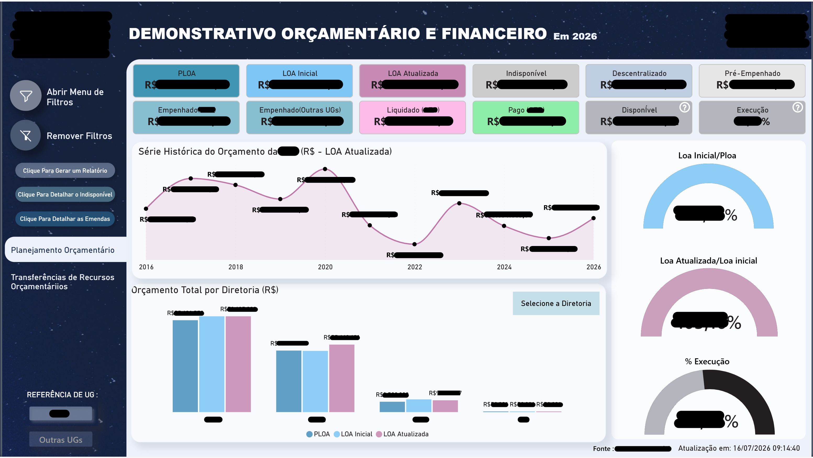
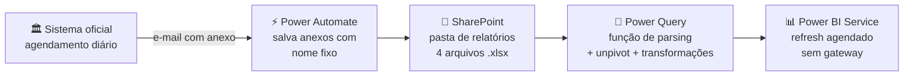

# 📊 Do ETL-legado à nuvem: modernização do pipeline de um painel orçamentário

> Como um painel Power BI que dependia de um **contrato de API dimensionado para 30x o consumo real**, um ETL sem documentação e um SQL Server intermediário evoluiu para um pipeline **100% nuvem, sem código em execução e sem infraestrutura própria** — sem alterar uma única medida ou visual.


---

## 🧩 O desafio

Um painel Power BI de acompanhamento orçamentário e financeiro de um órgão público apresentava a seguinte situação:

- Os dados vinham do **sistema oficial de relatórios orçamentários do Governo Federal** por meio de um **processo de ETL legado sem documentação disponível** — o conhecimento sobre seu funcionamento havia se perdido com a rotatividade da equipe;
- O acesso aos dados era feito por uma **conexão DaaS (Data as a Service) contratada junto ao provedor estatal de TI**, com parâmetros de volume **dimensionados para cerca de 30 vezes o consumo efetivamente utilizado (~3%)**;
- Os dados passavam por um **SQL Server intermediário** mantido só para isso;
- Uma das consultas dependia de um **arquivo hospedado fora do ambiente corporativo**, uma dependência crítica não mapeada.

**Missão**: otimizar o custo de obtenção dos dados, eliminar a infraestrutura desnecessária, automatizar a atualização diária e — requisito inegociável — **não quebrar nada** para os usuários do painel.

<p align="center">
  
  <br>
  <em>O painel em produção, atualizado automaticamente pelo pipeline — valores ocultados por confidencialidade.</em>
</p>

## 🔍 O diagnóstico (engenharia reversa do PBIX)

Dissecando o arquivo `.pbix` (que é um ZIP) e extraindo o modelo com [pbixray](https://github.com/Hugoberry/pbixray), descobri que:

1. O painel **nunca consumia a API diretamente** — lia 3 tabelas de fatos do SQL, cujos campos eram cópias exatas dos atributos dos relatórios padrão do sistema oficial. O ETL legado apenas transpunha relatórios para o banco;
2. O modelo exige o **formato longo** (uma linha por item de informação): **24 das 73 medidas DAX** filtram `NO_ITEM_INFORMACAO` sobre uma única coluna de valor — enquanto o sistema exporta em formato **largo** (uma coluna por item). O *unpivot* era, portanto, requisito estrutural;
3. O próprio sistema oficial permite **agendar relatórios com envio diário por e-mail** — a peça que destrava tudo.

## 🏗️ A solução

### Fase 1 — Carga de emergência (continuidade imediata)

Enquanto a solução definitiva era construída, um kit em **Python** manteve o painel vivo:

- `etl_emergencia.py`: lê os exports brutos do sistema (cabeçalho duplo, preâmbulo, linha Total), faz o *unpivot* e gera os dados no formato exato das tabelas SQL;
- `carga_sql.py`: carga via **pyodbc puro** (compatível até com o driver ODBC legado do Windows), com backup automático das tabelas, transação com rollback, conversão de tipos guiada pelo schema real e truncamento avisado de strings.

Validação: somas por item de informação conferidas **centavo a centavo** contra a linha "Total" do relatório oficial.

### Fase 2 — Arquitetura definitiva (100% nuvem)



O coração da fase 2 é uma **função Power Query (M) de parsing** que interpreta qualquer export bruto do sistema oficial:

- **Detecção automática de formato**: tenta abrir como Excel; se não for, parseia como CSV testando combinações de **encoding** (Windows-1252 / UTF-8) e **delimitador** (vírgula / ponto-e-vírgula / tab);
- **Leitura com largura fixa** (`Columns=250`) + corte das colunas vazias — porque o `Csv.Document` infere a largura da tabela pela primeira linha, e os exports do sistema começam com uma linha-título de célula única (que decapitaria o arquivo);
- **Resolução do cabeçalho duplo** (dimensões em pares código/descrição + métricas pivotadas), descarte de preâmbulo e da linha Total.

As 4 consultas do painel foram reescritas trocando **apenas o "miolo de entrada"** (SQL → SharePoint + transformação), preservando intactos todos os passos originais — merges com dimensões, chaves derivadas, regras de negócio. **Resultado: zero alteração no modelo, nas 73 medidas DAX e nos visuais.**

## 💥 Batalhas técnicas (e o que aprendi)

| # | Problema | Causa raiz | Solução |
|---|----------|-----------|---------|
| 1 | `HY104: precisão inválida` na carga SQL | Driver ODBC legado do Windows incompatível com SQLAlchemy/pandas | Reescrita em pyodbc puro + detecção automática de driver |
| 2 | `22001: truncamento de dados` | Colunas `int`/`datetime2` no banco recebendo strings do CSV (fast_executemany é rígido) | Conversão de tipos em Python guiada pelo `INFORMATION_SCHEMA` real |
| 3 | Coluna de valores monetários tipada como `int` no banco | Defeito de migração de VM | `ALTER COLUMN` para `numeric(20,2)` + carga resiliente com aviso |
| 4 | CSV lido como tabela de **1 coluna** no Power Query | `Csv.Document` infere largura pela primeira linha (título de célula única) | Largura fixa + corte de colunas vazias na função de parsing |
| 5 | "Credenciais inválidas" no Power BI Service com fallback de URL | O Service valida **toda** URL literal de `Web.Contents`, mesmo dentro de `try/otherwise` | Uma única URL por consulta; padronização em `.xlsx` |
| 6 | Erro DAX "Text vs Integer" na medida | Coluna que era `bigint` no SQL passou a chegar como texto | Tipagem explícita no M + varredura preventiva das 73 medidas |
| 7 | Colisão de nome de coluna na carga | Coluna física homônima de **coluna calculada DAX** | Colunas DAX não devem ser materializadas na fonte |
| 8 | Linhas "014/2016" pareciam lixo | Meses **13 e 14** do sistema contábil federal = períodos de apuração/encerramento | Validar a semântica de negócio antes de descartar dados 😅 |
| 9 | Conversão CSV→XLSX corrompia o layout | Excel pt-BR não separa colunas de CSV com vírgula no duplo clique | Importação via "Obter Dados" (ou export nativo em Excel) |

## 📈 Resultados

| Antes | Depois |
|-------|--------|
| Contrato de API dimensionado para ~30x o consumo real | **Custo otimizado**: métrica do contrato revisada com base em dados reais de consumo, com evolução da forma de acesso (descontinuação da conexão DaaS) |
| ETL sem documentação nem código-fonte disponíveis | Pipeline documentado, versionado e mantível por qualquer pessoa da equipe |
| SQL Server + gateway + scripts em servidor | **Zero infraestrutura própria** — tudo na nuvem M365 já licenciada |
| Atualização dependente de processo desconhecido | **Automação de ponta a ponta**, diária, sem intervenção humana |
| Arquivo de apoio hospedado fora do ambiente corporativo | Todas as fontes no SharePoint corporativo |

## 📂 Estrutura do repositório

```
├── powerquery/
│   ├── 1_fnParser.m             # função de parsing dos exports do sistema oficial
│   ├── 2_Base_Orcamentaria.m    # consultas reescritas das 4 tabelas de fatos
│   ├── 3_Base_Transferencia.m
│   ├── 4_Indisponivel.m
│   └── 5_emendas.m
├── python/
│   ├── etl_emergencia.py        # Fase 1: transformação dos exports
│   └── carga_sql.py             # Fase 1: carga no SQL Server (pyodbc)
├── docs/
│   └── GUIA-EMAIL-SHAREPOINT.md # guia operacional da arquitetura definitiva
└── README.md
```

> ⚠️ **Nota**: URLs, IPs, nomes de servidores, contas, sistemas e fornecedores foram anonimizados. Nenhum dado orçamentário real está neste repositório.

## 🛠️ Stack

**Power BI** (modelo, DAX, engenharia reversa de PBIX) · **Power Query / M** (funções customizadas, parsing resiliente, unpivot) · **Power Automate** (automação e-mail → SharePoint) · **SharePoint** · **Python** (pandas, pyodbc, openpyxl) · **SQL Server** · **Orçamento público federal** (domínio de negócio)

---

*Projeto real executado em ambiente de órgão público federal (2026). Detalhes sensíveis anonimizados.*
